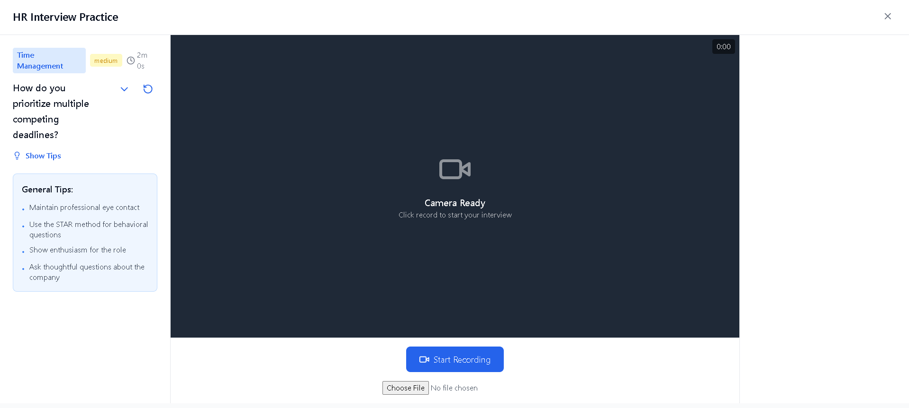
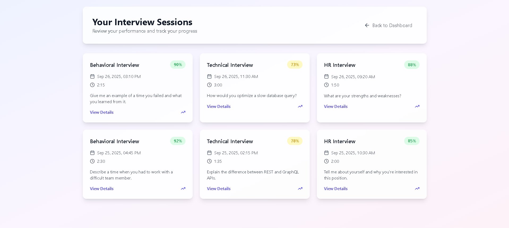

# 🎯 ConfidenceLab - AI-Powered Interview Analysis Platform

<div align="center">

**🎯 ConfidenceLab - AI-Powered Interview Analysis Platform**

**Transform your interview performance with AI-powered confidence analysis**

[](https://opensource.org/licenses/MIT)
[](https://reactjs.org/)
[](https://fastapi.tiangolo.com/)
[](https://python.org/)
[](https://www.typescriptlang.org/)

</div>

---

## 📋 Table of Contents

- [🌟 Overview](#-overview)
- [✨ Features](#-features)
- [🖼️ Screenshots](#️-screenshots)
- [🏗️ Architecture](#️-architecture)
- [🛠️ Installation](#️-installation)
- [🚀 Quick Start](#-quick-start)
- [📚 API Documentation](#-api-documentation)
- [🧪 Testing](#-testing)
- [📊 Performance](#-performance)
- [🔧 Configuration](#-configuration)
- [🤝 Contributing](#-contributing)
- [📄 License](#-license)
- [👥 Team](#-team)

---

## 🌟 Overview

**ConfidenceLab** is a cutting-edge AI-powered platform that revolutionizes interview preparation by providing real-time confidence analysis through advanced computer vision, speech recognition, and machine learning technologies. Practice HR, Technical, and Behavioral interviews with comprehensive feedback on your facial expressions, speech patterns, and body language.

### 🎯 Why ConfidenceLab?

- **🎭 Multi-Modal Analysis**: Combines facial emotion detection, speech analysis, and body language recognition
- **📊 Real-Time Feedback**: Get instant confidence scores and detailed breakdowns
- **🎓 Interview-Specific Practice**: Tailored questions and tips for different interview types
- **📈 Progress Tracking**: Monitor your improvement over time with detailed session history
- **🔒 Privacy-First**: All analysis happens locally, your data stays secure

---

## ✨ Features

### 🎥 **Advanced Video Analysis**

- **Facial Confidence**: Eye contact detection, facial tension analysis, smile authenticity
- **Speech Confidence**: Hesitation detection, tone analysis, clarity metrics, pace evaluation
- **Body Language**: Posture analysis, gesture recognition, body openness assessment

### 🎯 **Interview Types**

- **HR Interviews**: Behavioral questions, company culture, role-specific scenarios
- **Technical Interviews**: Coding problems, system design, technical concepts
- **Behavioral Interviews**: STAR method questions, leadership scenarios, problem-solving

### 📊 **Comprehensive Analytics**

- **Real-Time Scoring**: Live confidence percentage during recording
- **Detailed Breakdowns**: Individual scores for facial, speech, and body confidence
- **Session History**: Track progress over time with detailed metrics
- **Performance Insights**: Identify areas for improvement

### 🎨 **Modern UI/UX**

- **LeetCode-Style Layout**: Professional, distraction-free interface
- **Question Selection**: Choose from curated question banks
- **Responsive Design**: Works seamlessly on desktop and mobile

---

## 🖼️ Screenshots

### 🏠 **Main Interface**

#### Login & Dashboard


_Clean login interface with ConfidenceLab branding_


_User dashboard with statistics and interview options_

### 🎥 **Interview Practice**

#### Interview Interface


_LeetCode-style interview interface with question sidebar_


_Confidence analysis with detailed breakdowns_

### 📊 **Session Management**

#### Session History


_User's interview session history and details_

---

## 🏗️ Architecture

### 🎨 **Frontend (React + TypeScript)**

```
src/
├── components/           # React components
│   ├── Dashboard.tsx     # Main dashboard
│   ├── Login.tsx         # Authentication
│   ├── Signup.tsx        # User registration
│   ├── HRInterview.tsx   # HR interview interface
│   ├── TechnicalInterview.tsx # Technical interview
│   ├── BehavioralInterview.tsx # Behavioral interview
│   └── SessionDetails.tsx # Session analysis
├── utils/               # Utility functions
│   ├── auth.ts          # Authentication logic
│   └── questionLoader.ts # Question management
└── App.tsx              # Main application
```

### ⚙️ **Backend (FastAPI + Python)**

```
backend/
├── main.py              # FastAPI application
├── utils/
│   ├── analyze.py       # Core analysis engine
│   └── user_manager.py  # User & session management
├── requirements.txt     # Python dependencies
└── vosk-model/         # Speech recognition model
```

### 🗄️ **Data Storage**

```
data/
├── users.json          # User accounts
├── sessions.json       # Interview sessions
└── questions/          # Question banks
    ├── hr_questions.json
    ├── technical_questions.json
    └── behavioral_questions.json
```

---

## 🛠️ Installation

### 📋 **Prerequisites**

- **Node.js** 18.0+ and npm
- **Python** 3.10+
- **Git** for version control

### ⚡ **Windows Quick Start**

We provides automated scripts to get you up and running instantly:

1. **First-time Setup:**
   Double-click `setup_app.bat` to install dependencies and set up the environment.

2. **Launch Application:**
   Double-click `start_app.bat`. This will automatically start both the backend (Port 8000) and frontend (Port 5173) in separate windows.

### 🐧 **Manual Setup (Mac/Linux)**

1. **Clone the repository**

   ```bash
   git clone https://github.com/udaykumar0515/ConfidenceLab.git
   cd ConfidenceLab
   ```

2. **Install Frontend Dependencies**

   ```bash
   npm install
   ```

3. **Setup Backend Environment**

   ```bash
   cd backend
   python -m venv venv
   source venv/bin/activate
   pip install -r requirements.txt
   ```

4. **Start the Application**

   ```bash
   # Terminal 1: Start Backend
   cd backend
   uvicorn main:app --reload --host 0.0.0.0 --port 8000

   # Terminal 2: Start Frontend
   npm run dev
   ```

5. **Access the Application**
   - Frontend: http://localhost:5173
   - Backend API: http://localhost:8000
   - API Docs: http://localhost:8000/docs

---

## 🚀 Quick Start

### 👤 **First Time Setup**

1. **Create Account**: Sign up with email and password
2. **Choose Interview Type**: Select HR, Technical, or Behavioral
3. **Select Question**: Pick from curated question banks
4. **Start Recording**: Click record and begin your interview
5. **Get Analysis**: Receive instant confidence feedback
6. **Review Results**: Check detailed breakdowns and tips

### 🎯 **Best Practices**

- **Lighting**: Ensure good lighting for facial analysis
- **Audio**: Use a quiet environment for speech analysis
- **Positioning**: Sit centered in frame for body language detection
- **Practice**: Regular sessions improve accuracy and confidence

---

## 📚 API Documentation

### 🔐 **Authentication Endpoints**

```http
POST /auth/signup
Content-Type: application/json

{
  "email": "user@example.com",
  "password": "securepassword",
  "name": "John Doe"
}
```

```http
POST /auth/login
Content-Type: application/json

{
  "email": "user@example.com",
  "password": "securepassword"
}
```

### 📊 **Analysis Endpoints**

```http
POST /analyze
Content-Type: multipart/form-data

file: [video_file]
```

**Response:**

```json
{
  "score": 85.5,
  "facial_confidence": 82.3,
  "speech_confidence": 88.1,
  "body_confidence": 86.2,
  "video_duration": 120.5,
  "facial_breakdown": {
    "eye_contact": 85.0,
    "facial_tension": 80.0,
    "smile_authenticity": 82.0
  },
  "speech_breakdown": {
    "hesitation_score": 90.0,
    "tone_score": 85.0,
    "clarity_score": 88.0,
    "pace_score": 82.0
  },
  "body_breakdown": {
    "posture": 85.0,
    "gestures": 88.0,
    "openness": 86.0
  }
}
```

### 📈 **Session Management**

```http
GET /auth/user/{user_id}/sessions
Authorization: Bearer {token}
```

```http
GET /auth/user/{user_id}/stats
Authorization: Bearer {token}
```

---

## 🧪 Testing

### 🎯 **Frontend Testing**

```bash
npm run test
npm run test:coverage
```

### ⚙️ **Backend Testing**

_Coming soon..._

### 🔍 **Manual Testing Checklist**

- [ ] User registration and login
- [ ] Interview recording functionality
- [ ] Video analysis accuracy
- [ ] Session data persistence
- [ ] Question loading and selection

---

## 📊 Performance

### ⚡ **Optimization Features**

- **Model Caching**: Pre-loaded AI models for faster analysis
- **Parallel Processing**: Concurrent facial, speech, and body analysis
- **Efficient Video Processing**: Optimized video compression and analysis
- **Memory Management**: Automatic cleanup of video resources

---

## 🔧 Configuration

### 🌐 **Environment Variables**

The application runs with default settings. No additional configuration required for basic usage.

---

## 🤝 Contributing

We welcome contributions! Please see our [Contributing Guidelines](CONTRIBUTING.md) for details.

### 🛠️ **Development Setup**

1. Fork the repository
2. Create a feature branch: `git checkout -b feature/amazing-feature`
3. Make your changes
4. Add tests for new functionality
5. Commit your changes: `git commit -m 'Add amazing feature'`
6. Push to the branch: `git push origin feature/amazing-feature`
7. Open a Pull Request

### 🐛 **Bug Reports**

Please use our [Issue Template](.github/ISSUE_TEMPLATE/bug_report.md) when reporting bugs.

### 💡 **Feature Requests**

Use our [Feature Request Template](.github/ISSUE_TEMPLATE/feature_request.md) for new ideas.

---

## 📄 License

This project is licensed under the MIT License - see the [LICENSE](LICENSE) file for details.

---

## 👥 Team

<div>

**ConfidenceLab Development Team**

- **H. Uday Kumar** - [GitHub](https://github.com/udaykumar0515)
- **S. Muskan** - [GitHub](https://github.com/muski630346)
- **D. Vijay Baskar**
- **M. Abhinai**

</div>

---

## 🙏 Acknowledgments

- **Vosk** for speech recognition capabilities
- **DeepFace** for facial emotion analysis
- **MediaPipe** for body language detection
- **React** and **FastAPI** communities for excellent documentation
- **OpenAI** for inspiration in AI-powered applications
